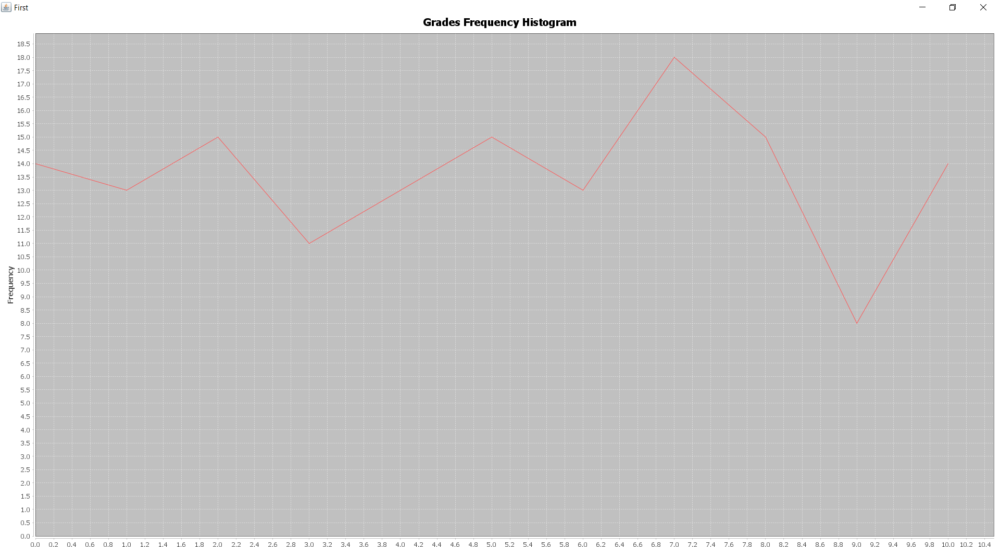

[](https://opensource.org/licenses/MIT)
[](https://app.travis-ci.com/Philippos01/Lab_Assignments)
[](https://codecov.io/gh/Philippos01/Lab_Assignments)


# ***Maven Assignment***

## *About the project*

An assignment for the [**Software Engineering in Practice**](https://edu.dmst.aueb.gr/course/view.php?id=77) course about the maven project management and comprehension tool. More specifically in this assignment we will create a Histogram with some grades(0-10) using java for coding and maven for packaging and deploying the program.

## *Running the Program*

So, in order to run the program you simply go to the [pom.xml](gradeshistogram/pom.xml) file and run the command: ```mvn package``` and then it will compile the source code and also package it as a jar file and put it into the target folder.
Then you can simply use the following command:<br>
```java -jar gradeshistogram/target/gradeshistogram-0.0.1-SNAPSHOT-jar-with-dependencies.jar <Give the path of grades.txt file in your computer>```
<br>
and the output should be the following image:
<br>
<br>


### **Supervisor:** [zkotti](https://github.com/zkotti) 
<br>

Proceed to the new [README.md](https://github.com/Philippos01/Lab_Assignments/blob/development/Unittesting/README.md) about Unit tests.